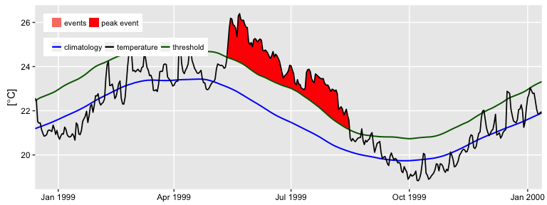
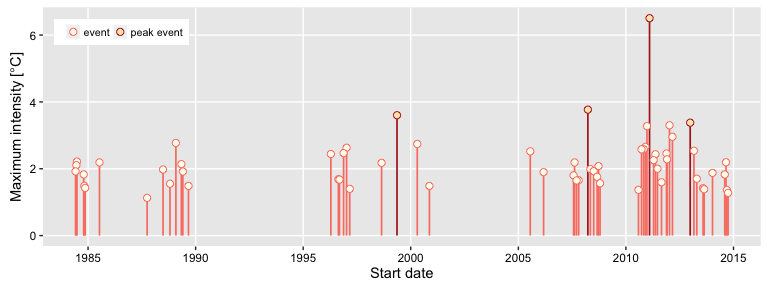

<!-- README.md is generated from README.Rmd. Please edit that file -->
RmarineHeatWaves
================

The RmarineHeatWaves package is a translation of the original Python code written by Eric C. J. Oliver that can be found on [GitHub](https://github.com/ecjoliver/marineHeatWaves).

The RmarineHeatWaves R package contains a number of functions which calculate and display marine heat waves according to the definition of Hobday et al. (2016). The marine cold spell option was implemented in version 0.13 (21 Nov 2015) of the Python module as a result of the preparation of Schlegel et al. (submitted), wherein the cold events are introduced and receive a brief overview.

The functions
=============

<table style="width:47%;">
<colgroup>
<col width="30%" />
<col width="16%" />
</colgroup>
<thead>
<tr class="header">
<th>Function</th>
<th>Description</th>
</tr>
</thead>
<tbody>
<tr class="odd">
<td><code>detect()</code></td>
<td>The main function which detects the events as per the definition of Hobday et al. (2016).</td>
</tr>
<tr class="even">
<td><code>make_whole()</code></td>
<td>Constructs a continuous, uninterrupted time series of temperatures.</td>
</tr>
<tr class="odd">
<td><code>block_average()</code></td>
<td>Calculates annual means for event metrics.</td>
</tr>
<tr class="even">
<td><code>event_line()</code></td>
<td>Creates a line plot of marine heat waves or cold spells.</td>
</tr>
<tr class="odd">
<td><code>lolli_plot()</code></td>
<td>Creates a timeline of selected event metrics.</td>
</tr>
</tbody>
</table>

The package also provides data of observed SST records for three historical MHWs: the 2011 Western Australia event, the 2012 Northwest Atlantic event and the 2003 Mediterranean event.

For example, here is the `detect()` function applied applied to the Western Australian test data:

``` r
library(RmarineHeatWaves)
ts <- make_whole(sst_WA)
res <- detect(ts , climatology_start = 1983, climatology_end = 2012)
head(res, 3)
#> $clim
#> Source: local data frame [12,053 x 9]
#> Groups: event_no [61]
#> 
#>      doy       date  temp seas_clim_year thresh_clim_year thresh_criterion
#>    (dbl)     (date) (dbl)          (dbl)            (dbl)            (lgl)
#> 1      1 1982-01-01 20.94       21.60802         22.96048            FALSE
#> 2      2 1982-01-02 21.25       21.63485         22.99871            FALSE
#> 3      3 1982-01-03 21.38       21.66207         23.03758            FALSE
#> 4      4 1982-01-04 21.16       21.68951         23.07713            FALSE
#> 5      5 1982-01-05 21.26       21.71686         23.11297            FALSE
#> 6      6 1982-01-06 21.61       21.74365         23.14603            FALSE
#> 7      7 1982-01-07 21.74       21.76988         23.17748            FALSE
#> 8      8 1982-01-08 21.50       21.79576         23.20800            FALSE
#> 9      9 1982-01-09 21.40       21.82165         23.23658            FALSE
#> 10    10 1982-01-10 21.36       21.84782         23.26493            FALSE
#> ..   ...        ...   ...            ...              ...              ...
#> Variables not shown: duration_criterion (lgl), event (lgl), event_no (int)
#> 
#> $event
#> Source: local data frame [60 x 23]
#> Groups: event_no [60]
#> 
#>    index_start index_stop event_no duration date_start  date_stop
#>          (int)      (int)    (int)    (dbl)     (date)     (date)
#> 1          885        889        1        5 1984-06-03 1984-06-07
#> 2          899        904        2        6 1984-06-17 1984-06-22
#> 3          908        926        3       19 1984-06-26 1984-07-14
#> 4         1023       1029        4        7 1984-10-19 1984-10-25
#> 5         1033       1037        5        5 1984-10-29 1984-11-02
#> 6         1048       1052        6        5 1984-11-13 1984-11-17
#> 7         1291       1297        7        7 1985-07-14 1985-07-20
#> 8         2100       2104        8        5 1987-10-01 1987-10-05
#> 9         2370       2375        9        6 1988-06-27 1988-07-02
#> 10        2488       2498       10       11 1988-10-23 1988-11-02
#> ..         ...        ...      ...      ...        ...        ...
#> Variables not shown: date_peak (date), int_mean (dbl), int_max (dbl),
#>   int_var (dbl), int_cum (dbl), int_mean_rel_thresh (dbl),
#>   int_max_rel_thresh (dbl), int_var_rel_thresh (dbl), int_cum_rel_thresh
#>   (dbl), int_mean_abs (dbl), int_max_abs (dbl), int_var_abs (dbl),
#>   int_cum_abs (dbl), int_mean_norm (dbl), int_max_norm (dbl), rate_onset
#>   (dbl), rate_decline (dbl)
event_line(res, metric = "int_max")
```



``` r
lolli_plot(res)
```



References
==========

Hobday, A.J. et al. (2016), A hierarchical approach to defining marine heatwaves, Progress in Oceanography, 141, pp. 227-238, doi: 10.1016/j.pocean.2015.12.014 [pdf](http://passage.phys.ocean.dal.ca/~olivere/docs/Hobdayetal_2016_PO_HierarchMHWDefn.pdf)

Schlegel, R. W., Oliver, E. C. J., Wernberg, T. W., Smit, A. J. (submitted) Coastal and offshore co-occurrences of marine heatwaves and cold-spells. Progress in Oceanography.

Acknowledgements
================

The Python code was written by Eric C. J. Oliver.

Contributors to the Marine Heatwaves definition and its numerical implementation include Alistair J. Hobday, Lisa V. Alexander, Sarah E. Perkins, Dan A. Smale, Sandra C. Straub, Jessica Benthuysen, Michael T. Burrows, Markus G. Donat, Ming Feng, Neil J. Holbrook, Pippa J. Moore, Hillary A. Scannell, Alex Sen Gupta, and Thomas Wernberg.

The translation from Python to R was done by A. J. Smit and the graphing functions were contributed to by Robert. W. Schlegel.

Contact
=======

A. J. Smit Department for Biodiversity & Conservation Biology, University of the Western Cape, Private Bag X17, Bellville 7535, South Africa, E-mail: <ajsmit@uwc.ac.za>, Work tel.: +27 (0)21 959 3783
