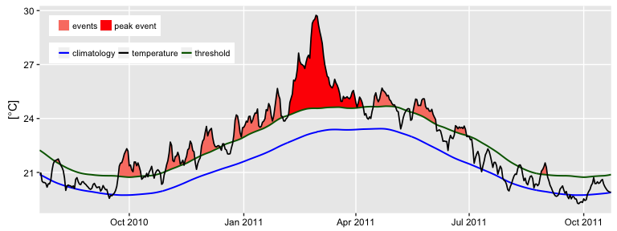
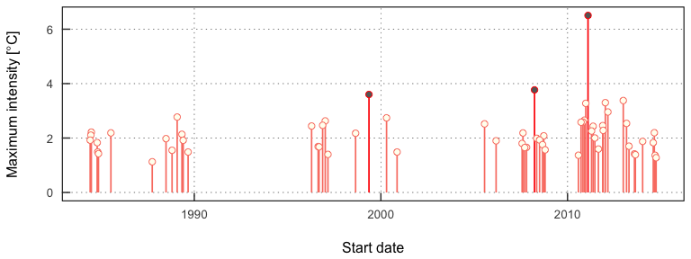
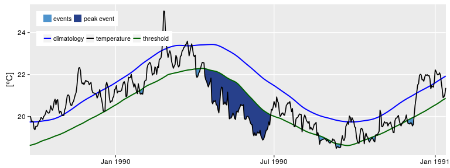
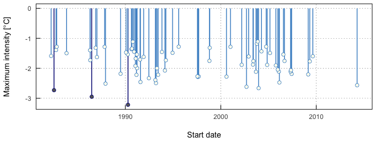
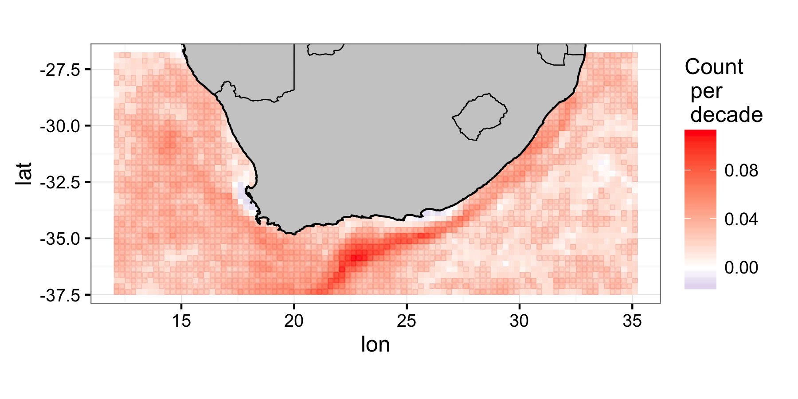
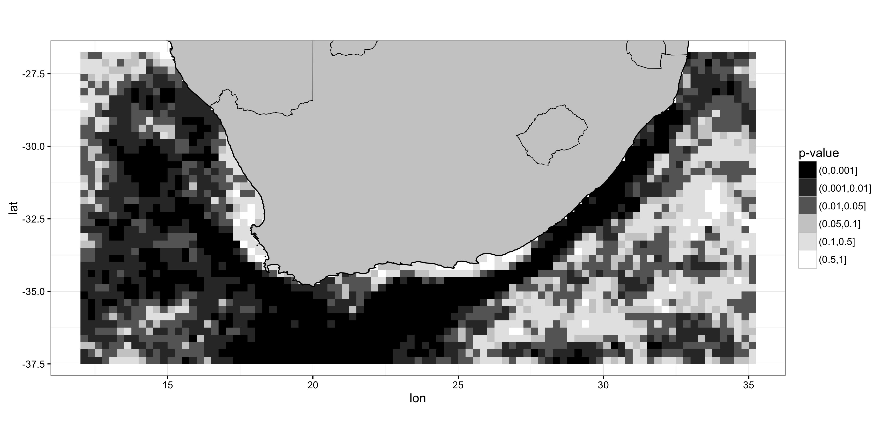

<!-- README.md is generated from README.Rmd. Please edit that file -->
RmarineHeatWaves
================

[](http://cran.r-project.org/package=RmarineHeatWaves) [](https://travis-ci.org/ajsmit/RmarineHeatWaves) 

The RmarineHeatWaves package is a translation of the original Python code written by Eric C. J. Oliver that can be found on [GitHub](https://github.com/ecjoliver/marineHeatWaves).

The RmarineHeatWaves R package contains a number of functions which calculate and display marine heat waves according to the definition of Hobday et al. (2016). The marine cold spell option was implemented in version 0.13 (21 Nov 2015) of the Python module as a result of the preparation of Schlegel et al. (in press), wherein the cold events are introduced and briefly discussed.

This package may be found on [CRAN](https://cran.r-project.org/web/packages/RmarineHeatWaves/index.html). Alternatively, you may install it from GitHub by issuing the following command:

`devtools::install_github("ajsmit/RmarineHeatWaves")`

The functions
=============

<table style="width:47%;">
<colgroup>
<col width="30%" />
<col width="16%" />
</colgroup>
<thead>
<tr class="header">
<th>Function</th>
<th>Description</th>
</tr>
</thead>
<tbody>
<tr class="odd">
<td><code>detect()</code></td>
<td>The main function which detects the events as per the definition of Hobday et al. (2016).</td>
</tr>
<tr class="even">
<td><code>make_whole()</code></td>
<td>Constructs a continuous, uninterrupted time series of temperatures.</td>
</tr>
<tr class="odd">
<td><code>block_average()</code></td>
<td>Calculates annual means for event metrics.</td>
</tr>
<tr class="even">
<td><code>event_line()</code></td>
<td>Creates a line plot of marine heat waves or cold spells.</td>
</tr>
<tr class="odd">
<td><code>lolli_plot()</code></td>
<td>Creates a timeline of selected event metrics.</td>
</tr>
<tr class="even">
<td><code>exceedence()</code></td>
<td>A function similar to <code>detect()</code> but that detects consecutive days above/ below a given threshold.</td>
</tr>
</tbody>
</table>

The package also provides data of observed SST records for three historical MHWs: the 2011 Western Australia event, the 2012 Northwest Atlantic event and the 2003 Mediterranean event.

The detect and graphing functions
---------------------------------

Here is the `detect()` function applied to the Western Australian test data, which are also discussed by Hobday et al. (2016):

``` r
library(RmarineHeatWaves); library(dplyr)
ts <- make_whole(sst_WA)
mhw <- detect(ts, climatology_start = 1983, climatology_end = 2012)
mhw$event %>% 
  ungroup() %>%
  select(event_no, duration, date_start, date_peak, int_mean, int_max, int_cum) %>% 
  dplyr::arrange(-int_cum)
#> # A tibble: 60 × 7
#>    event_no duration date_start  date_peak int_mean int_max int_cum
#>       <int>    <dbl>     <date>     <date>    <dbl>   <dbl>   <dbl>
#> 1        22       95 1999-05-13 1999-05-22    2.498   3.602  237.34
#> 2        42       60 2011-02-06 2011-02-28    3.212   6.506  192.71
#> 3        49       47 2012-01-11 2012-01-27    2.226   3.300  104.61
#> 4        50       46 2012-03-01 2012-04-10    1.994   2.958   91.71
#> 5        41       40 2010-12-24 2011-01-28    2.157   3.275   86.28
#> 6        31       34 2008-03-26 2008-04-14    2.237   3.769   76.04
#> 7        18       38 1996-11-17 1996-12-21    1.820   2.467   69.17
#> 8        23       29 2000-04-21 2000-05-04    1.950   2.742   56.55
#> 9        48       29 2011-11-30 2011-12-19    1.760   2.282   51.05
#> 10       39       24 2010-10-30 2010-11-03    1.623   2.585   38.95
#> # ... with 50 more rows
```

The corresponding `event_line()` and `lolli_plot()`, which represent the massive Western Australian heatwave of 2011, look like this:

``` r
event_line(mhw, spread = 200, metric = "int_cum",
           start_date = "2010-10-01", end_date = "2011-08-30")
```



``` r
lolli_plot(mhw)
```



Marine cold spells are also accommodated. Here is a cold spell detected in the OISST data for Western Australia:

``` r
mcs <- detect(ts, climatology_start = 1983, climatology_end = 2012, cold_spells = TRUE)
mcs$event %>% 
  ungroup() %>%
  select(event_no, duration, date_start, date_peak, int_mean, int_max, int_cum) %>% 
  dplyr::arrange(int_cum)
#> # A tibble: 71 × 7
#>    event_no duration date_start  date_peak int_mean int_max int_cum
#>       <int>    <dbl>     <date>     <date>    <dbl>   <dbl>   <dbl>
#> 1        16       76 1990-04-13 1990-05-11   -2.538  -3.218 -192.89
#> 2        54       58 2003-12-19 2004-01-23   -1.798  -2.662 -104.31
#> 3        71       52 2014-04-14 2014-05-05   -1.819  -2.566  -94.59
#> 4         8       38 1986-06-24 1986-07-17   -2.010  -2.951  -76.37
#> 5        51       32 2003-09-08 2003-09-16   -1.561  -2.117  -49.95
#> 6        31       28 1993-03-18 1993-04-11   -1.710  -2.494  -47.88
#> 7        47       27 2002-09-11 2002-09-25   -1.715  -2.618  -46.30
#> 8        40       22 1997-08-09 1997-08-22   -1.688  -2.290  -37.14
#> 9        29       18 1992-06-20 1992-07-05   -1.935  -2.330  -34.82
#> 10       41       18 1997-09-08 1997-09-15   -1.736  -2.273  -31.25
#> # ... with 61 more rows
```

The plots showing the marine cold spells look like this:

``` r
event_line(mcs, spread = 200, metric = "int_cum",
           start_date = "1990-01-01", end_date = "1990-08-30")
```



``` r
lolli_plot(mcs)
```



In the development version of ggplot2 (2.1.0.9001), Hadley has *again* fiddled with some of the plot defaults and this has resulted in the legend position in the above plots being affected. I will make sure that the next release of RmarineHeatWaves fixes this problem. The next version of this package will also include some major updates to the plotting functions. An update will be released in the next month or two.

We can also load the gridded 0.25 degree Reynolds [OISST data](http://www.ncdc.noaa.gov/thredds/oisst-catalog.html) and apply the function pixel by pixel over all of the days of data. The example data used here have 93 longitude steps, 43 latitude steps, and cover 12797 days (1981 to 2016). We apply the `detect()` function to these data, fit a generalised linear model (GLM), and then plot the trend per decade of the marine heatwave count. In other words, have marine heatwaves become more or less frequent in recent years? Under climate change we can expect that extreme events would tend to occur more frequently and be of greater intensity. Indeed, we can clearly see in the figure below of the result of the GLM, how the Agulhas Current has been experiencing marine heat waves more frequently in recent decades. But there are two smaller areas, one along the western side of the Cape Peninsula in the Benguela Upwelling system and another around the Eastern Cape Province near Algoa Bay, where the frequency of marine heat waves seems to have actually been decreasing -- although the P-value of the decreasing trend is &gt; 0.05, and therefore not significant.

 

Please read the package [vignette](https://github.com/ajsmit/RmarineHeatWaves/blob/master/vignettes/gridded-event-detection.Rmd) to see how to load a netCDF file with the OISST data, apply the RmarineHeatWaves function to the whole 3D array of data, and then fit the GLM and plot the data.

The exceedence function
-----------------------

In addition to the calculation of extreme events, consecutive days over a given static threshold may be calculated with the `exceedence()` function.

``` r
exc <- exceedence(ts, threshold = 25)
exc$exceedence %>% 
  ungroup() %>%
  select(exceedence_no, duration, date_start, date_peak, int_mean, int_max, int_cum) %>% 
  dplyr::arrange(-int_cum)
#> # A tibble: 11 × 7
#>    exceedence_no duration date_start  date_peak int_mean int_max int_cum
#>            <int>    <dbl>     <date>     <date>    <dbl>   <dbl>   <dbl>
#> 1              7       52 2011-02-08 2011-02-28   1.6740    4.74   87.05
#> 2              6       25 2008-04-03 2008-04-14   0.9800    2.19   24.50
#> 3             10       41 2012-03-03 2012-04-10   0.4385    1.37   17.98
#> 4              2       17 1999-05-13 1999-05-22   0.8559    1.40   14.55
#> 5              5       10 2000-05-03 2000-05-04   0.6970    1.01    6.97
#> 6             11       10 2013-03-02 2013-03-09   0.3440    0.90    3.44
#> 7              8        9 2011-04-20 2011-04-22   0.3556    0.69    3.20
#> 8              9        6 2012-02-08 2012-02-09   0.5267    0.90    3.16
#> 9              3        7 1999-06-02 1999-06-03   0.2071    0.27    1.45
#> 10             1        5 1989-05-05 1989-05-06   0.2860    0.36    1.43
#> 11             4        6 2000-04-21 2000-04-23   0.1550    0.41    0.93
```

The same function may be used to calculate consecutive days below a threshold, too.

``` r
exc <- exceedence(ts, threshold = 19, below = TRUE)
exc$exceedence %>% 
  ungroup() %>%
  select(exceedence_no, duration, date_start, date_peak, int_mean, int_max, int_cum) %>% 
  dplyr::arrange(int_cum)
#> # A tibble: 22 × 7
#>    exceedence_no duration date_start  date_peak int_mean int_max int_cum
#>            <int>    <dbl>     <date>     <date>    <dbl>   <dbl>   <dbl>
#> 1             17       46 2003-09-06 2003-09-16  -0.6009   -1.34  -27.64
#> 2             16       31 2002-09-08 2002-09-25  -0.8481   -1.88  -26.29
#> 3             13       24 1997-09-03 1997-09-15  -0.7692   -1.49  -18.46
#> 4             20       25 2005-09-26 2005-10-12  -0.5420   -1.10  -13.55
#> 5             12       18 1997-08-13 1997-08-22  -0.6944   -1.25  -12.50
#> 6              1       20 1982-09-15 1982-09-24  -0.4080   -0.76   -8.16
#> 7              2       17 1986-07-14 1986-07-17  -0.4606   -0.94   -7.83
#> 8             15       11 2000-08-06 2000-08-13  -0.6891   -1.08   -7.58
#> 9              5       26 1990-08-22 1990-09-10  -0.2288   -0.52   -5.95
#> 10            21        8 2006-09-05 2006-09-07  -0.6238   -0.90   -4.99
#> # ... with 12 more rows
```

References
==========

Hobday, A.J. et al. (2016). A hierarchical approach to defining marine heatwaves, Progress in Oceanography, 141, pp. 227-238.

Schlegel, R. W., Oliver, E. C. J., Wernberg, T. W., Smit, A. J. (in press). Coastal and offshore co-occurrences of marine heatwaves and cold-spells. Progress in Oceanography.

Acknowledgements
================

The Python code was written by Eric C. J. Oliver.

Contributors to the Marine Heatwaves definition and its numerical implementation include Alistair J. Hobday, Lisa V. Alexander, Sarah E. Perkins, Dan A. Smale, Sandra C. Straub, Jessica Benthuysen, Michael T. Burrows, Markus G. Donat, Ming Feng, Neil J. Holbrook, Pippa J. Moore, Hillary A. Scannell, Alex Sen Gupta, and Thomas Wernberg.

The translation from Python to R was done by A. J. Smit and the graphing functions were contributed to by Robert. W. Schlegel.

Contact
=======

A. J. Smit Department for Biodiversity & Conservation Biology, University of the Western Cape, Private Bag X17, Bellville 7535, South Africa, E-mail: <ajsmit@uwc.ac.za>, Work tel.: +27 (0)21 959 3783
