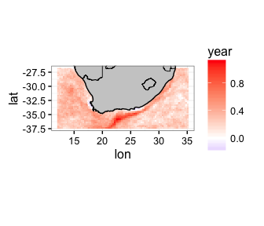

```{r global_options, include = FALSE}
knitr::opts_chunk$set(fig.width = 5, fig.align = 'center',
                      echo = FALSE, warning = FALSE, 
                      message = FALSE, tidy = FALSE)
```

```{r load-pkg, echo = FALSE, eval = FALSE}
library(RmarineHeatWaves)
library(ncdf4)
library(plyr)
library(dplyr)
library(tibble)
library(reshape2)
library(lubridate)
library(ggplot2)
library(doMC); doMC::registerDoMC(cores = 4)
```

First, we read in the netCDF 0.25 degree OISST data; specifically, we save the only variable, `sst`, as a multidimensional array (longitude, latitude and time/date). We then construct a list with names for this SST array. The names for the three dimensions are simply a list of longitudes, latitudes and dates, which we can get directly from this netCDF file (note: not all netCDF files are created equally, and sometimes vectors of lats, lons and dates need to be created based on the start value for lat/lon/date in the netCDF, and the "steps" between subsequent lats/lons/dates).

```{r read-netcdf, echo = TRUE, eval = FALSE}
nc <- nc_open("/Users/ajsmit/spatial/OISST/daily/OISST-V2-AVHRR_agg.nc")
# print(nc)
sst <- ncvar_get(nc, varid = "sst") # reads in the only var in netCDF file
dimnames(sst) <- list(lon = nc$dim$lon$vals,
                      lat = nc$dim$lat$vals, 
                      t = nc$dim$time$vals)
```

Now we need to take this array of SST data and convert it into a a data frame using **reshape2**'s `melt` function. This creates columns names **lon**, **lat** and **t** (**t** is the time vector, which is required by **RmarineHeatWave**'s `make_whole` and `detect` functions). Now each SST value is indexed by a unique combination of **lon**, **lat** and **t**.

```{r sst-df, echo = TRUE, eval = FALSE}
sst <- as_tibble(melt(sst, value.name = "temp"))
sst$t <- as.Date(sst$t, origin = '1978-01-01')
```

Since the data frame of SSTs contains some NAs where seawater temperatures are not available due to the presence of land, I remove all cases with NAs.

```{r remove-NA, echo = TRUE, eval = FALSE}
sst1 <- sst %>%
  na.omit()
rm(sst); rm(nc)
```

Now I make a wrapper function to combine `make_whole` and `detect`. This increases the ease of use of this function with **plyr**'s `ddply` function, but most importantly, it pulls out only the **event** portion of the list of results (i.e. ignoring **clim**).

```{r detect-fun, echo = TRUE, eval = FALSE}
OISST_detect <- function(dat) {
  dat <- dat[,3:4]
  start = "1983-01-01"
  end = "2012-12-31"
  whole <- make_whole(dat)
  mhw <- detect(whole, climatology_start = start, climatology_end = end,
                min_duration = 5, max_gap = 2, cold_spells = FALSE)
  events <- mhw$event
  return(events)
  }
```

And now I apply the `OISST_detect` function to the SST data and save the results as a .Rdata file.

```{r apply-detect-fun, echo = TRUE, eval = FALSE}
# it takes a long time...
system.time(OISST_events <- ddply(sst1, .(lon, lat), OISST_detect, .parallel = TRUE))
 #   user  system elapsed 
 # 1862.3   205.9   704.8 
save(OISST_events, file = "/Users/ajsmit/spatial/OISST/daily/OISST_events.Rdata")
```

Because I saved the results to a file I can load these rather than rerunning the `OISST_detect` function, which takes about 11 minutes to execute on my 4 GHz iMac.

```{r load-SST, echo = TRUE, eval = FALSE}
# in case it was calculated and saved earlier, we can load it here now:
# load("/Users/ajsmit/spatial/OISST/daily/OISST_events.Rdata")
```

```{r event-tally, echo = TRUE, eval = FALSE}
# summarise the number of unique longitude, latitude and year combination:
event_freq <- OISST_events %>% 
  mutate(year = year(date_start)) %>% 
  group_by(lon, lat, year) %>% 
  summarise(n = n())
head(event_freq)

# create complete grid for merging with:
sst.grid <- sst1 %>% 
  select(lon, lat, t) %>% 
  mutate(t = lubridate::year(t)) %>% 
  unique() # slow...
colnames(sst.grid)[colnames(sst.grid) == 't'] <- 'year'

# and merge:
OISST_n <- left_join(sst.grid, event_freq)
OISST_n[is.na(OISST_n)] <- 0
```

```{r trend-fun, echo = TRUE, eval = FALSE}
lin_fun <- function(ev) {
  mod1 <- glm(n ~ year, family = poisson(link = "log"), data = ev)
  tr <- coefficients(mod1)[2] * 10
  return(tr)
}
```

```{r apply-trend-fun, echo = TRUE, eval = FALSE}
OISST_nTrend <- ddply(OISST_n, .(lon, lat), lin_fun)
head(OISST_nTrend)
```

```{r load-geography, echo = TRUE, eval = FALSE}
## Coastline of African continent and some borders:
load("/Users/ajsmit/Dropbox/repos/Trend_Analysis/graph/africa_coast.RData")
load("/Users/ajsmit/Dropbox/repos/Trend_Analysis/graph/africa_borders.Rdata")
load("/Users/ajsmit/Dropbox/repos/Trend_Analysis/graph/south_africa_coast.RData")
load("/Users/ajsmit/Dropbox/repos/Trend_Analysis/graph/sa_provinces_new.RData")
```

```{r the-figure, echo = TRUE, eval = FALSE}
ggplot(OISST_nTrend, aes(lon, lat)) +
  geom_raster(aes(fill = year), interpolate = FALSE) +
  scale_fill_gradient2(high = "red", mid = "white", low = "blue", midpoint = 0) +
  geom_polygon(data = south_africa_coast, aes(x = lon, y = lat, group = group), 
               colour = NA, fill = "grey80") +
  geom_path(data = africa_borders, aes(x = lon, y = lat, group = group), 
            size = 0.3, colour = "black") +
  geom_polygon(data = south_africa_coast, aes(x = lon, y = lat, group = group),
               size = 0.5, colour = "black", fill = NA) +
  coord_fixed(ratio = 1, xlim = c(12.12, 35.12), ylim = c(-26.88, -37.38), expand = TRUE) +
  theme_bw()
# ggsave(file = "the-figure-1.png", width = 12, height = 8)
```


